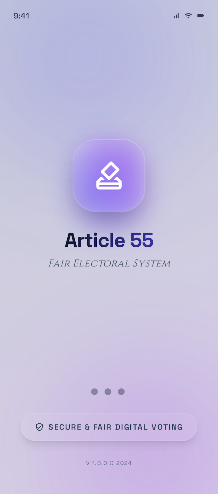
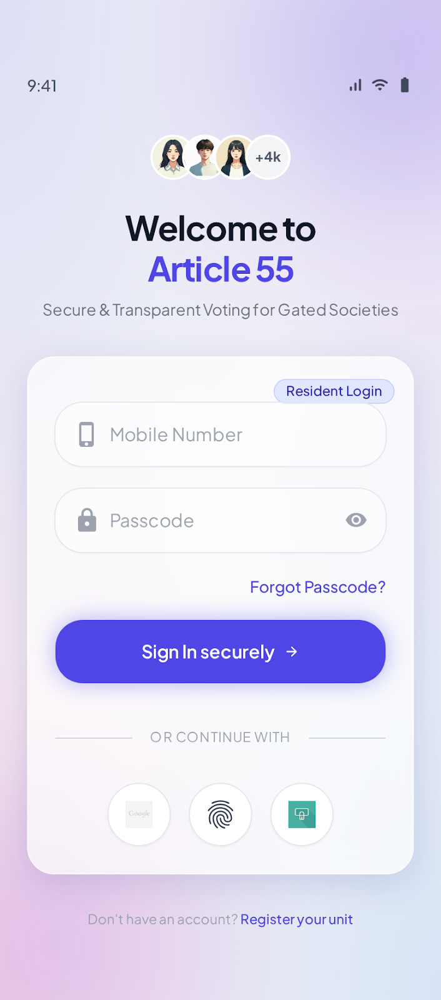
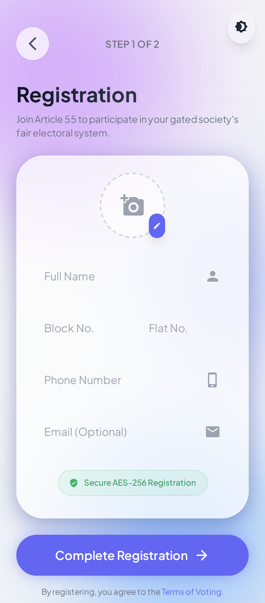
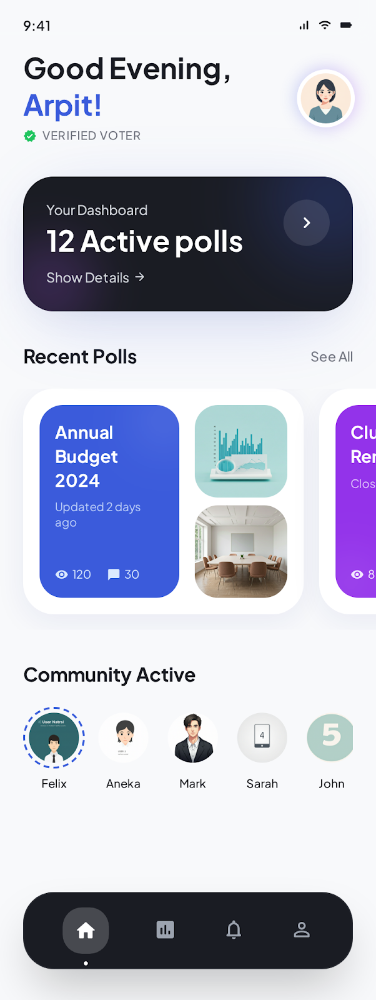

<div align="center">

# 🗳️ Article 55 – Fair Electoral System

**A production-grade, secure Flutter app for gated society voting**

[](https://flutter.dev/)
[](https://dart.dev/)
[](.)
[](https://supabase.com/)
[](https://m3.material.io/)

*Phone login • Role-based access • Admin control panel • Live poll monitoring • Glassmorphism UI*

</div>

---

## 🎯 Overview

Article 55 is a clean-architecture mobile app that enables secure, transparent digital voting for gated societies and residential communities. It provides:

- Phone + passcode authentication with role-based routing
- Resident registration with flat/block uniqueness enforcement
- User dashboard with active polls, recent polls carousel, and community activity
- Admin control panel with live voting statistics, quick actions, and real-time monitoring
- A premium, glassmorphic design system built on Material 3

---

## 📸 App Preview

| Splash Screen | Login Screen | Registration | User Dashboard | Admin Dashboard |
|---|---|---|---|---|
|  |  |  |  |  |

---

## 🏗️ App Architecture

```text
┌──────────────────────────────────────────────────────────────────┐
│                         Flutter App UI                           │
│  Splash → Login ─┬→ User Dashboard (polls, community, profile)   │
│                  └→ Admin Dashboard (stats, actions, monitoring)  │
│           ↕                                                      │
│      Registration                                                │
└──────────────────────────────┬───────────────────────────────────┘
                               │
                    Provider State Layer
                  (AuthProvider + UserModel)
                               │
                  ┌────────────┴────────────┐
                  │                         │
            AuthService               SupabaseService
        (login / register /          (client init +
            sign out)                  DB queries)
                  │                         │
                  └────────────┬────────────┘
                               │
                          Supabase DB
                    (users table + RLS)
```

---

## ✨ Core Features

### 🔐 Authentication System
- Phone number + passcode login (no OTP required)
- Role-based routing: `user` → User Dashboard, `admin` → Admin Dashboard
- Secure session handling with logout functionality
- Demo mode for local testing without Supabase

### 📋 User Registration
- Collect: Name, Block No., Flat No., Phone, Email (optional)
- Phone uniqueness + flat number uniqueness enforcement
- Clean validation with inline error messaging
- Auto-assign `user` role on registration

### 📊 User Dashboard
- Dynamic greeting based on time of day
- Verified Voter badge
- Active polls summary card with dark theme
- Horizontally scrollable Recent Polls carousel
- Community Active members section
- Custom bottom navigation bar

### 🛡️ Admin Dashboard
- Gradient "Admin Control" header with notification bell
- Stats grid: Total Votes (24,592) + Turnout (87.4%)
- Quick Actions: Create Poll (blue) + Users (purple) gradient cards
- Scrollable chip row: Reports, Audit Logs, Config
- Live Monitoring cards with progress bars and status badges
- Floating bottom nav with elevated FAB button

### 🎨 Premium Design System
- Material 3 with Plus Jakarta Sans typography
- Glassmorphism cards with backdrop blur
- Smooth fade-in-up animations
- Custom reusable widgets: `GradientButton`, `CustomTextField`, `AnimatedCard`, `LoadingIndicator`
- Curated color palette: Indigo-600 primary, Violet-500 accent

---

## 🛠️ Technology Stack

| Category | Technology |
|---|---|
| **Framework** | Flutter (latest stable, null-safe) |
| **State Management** | Provider |
| **Backend / Auth** | Supabase (Postgres + Auth) |
| **Typography** | Google Fonts (Plus Jakarta Sans, Cinzel) |
| **Architecture** | Clean Architecture (models, services, providers, screens, widgets) |
| **Design** | Material 3, Glassmorphism, Gradient animations |

---

## 📁 Project Structure

```text
lib/
 ├── main.dart                          # Entry point + dotenv load
 ├── app.dart                           # MaterialApp + routes + Provider setup
 ├── config/
 │   └── env_config.dart                # Reads .env via flutter_dotenv
 ├── core/
 │   ├── constants/
 │   │   ├── app_colors.dart            # Color palette + gradients
 │   │   └── app_strings.dart           # All UI strings
 │   ├── theme/
 │   │   └── app_theme.dart             # Material 3 theme + glass decorations
 │   └── utils/
 │       └── validators.dart            # Phone, name, flat, email validators
 ├── models/
 │   └── user_model.dart                # User model + JSON serialization
 ├── services/
 │   ├── supabase_service.dart          # Supabase client init
 │   └── auth_service.dart              # Login / register / sign out + demo mode
 ├── providers/
 │   └── auth_provider.dart             # Auth state (ChangeNotifier)
 ├── screens/
 │   ├── splash_screen.dart             # Animated splash + auto-navigate
 │   ├── login_screen.dart              # Phone + passcode + role routing
 │   ├── registration_screen.dart       # Multi-field form + validation
 │   ├── user_dashboard_screen.dart     # Polls, community, bottom nav
 │   └── admin_dashboard_screen.dart    # Stats, actions, monitoring, FAB nav
 └── widgets/
     ├── custom_text_field.dart         # Glassmorphic input field
     ├── gradient_button.dart           # Gradient CTA with loading state
     ├── animated_card.dart             # Fade-in-up animated container
     └── loading_indicator.dart         # Three-dot staggered animation
```

---

## 🚀 Quick Start

### Prerequisites
- Flutter SDK (latest stable)
- Supabase project (optional — demo mode works without it)

### 1) Install dependencies

```bash
flutter pub get
```

### 2) Configure environment

Create a `.env` file in the project root:

```env
SUPABASE_URL=https://your-project.supabase.co
SUPABASE_ANON_KEY=your_supabase_anon_key
DEMO_MODE=true
```

> Set `DEMO_MODE=false` once your Supabase project is configured.

### 3) Setup Supabase table

Run in Supabase SQL Editor:

```sql
CREATE TABLE IF NOT EXISTS users (
    id           UUID PRIMARY KEY DEFAULT gen_random_uuid(),
    name         TEXT NOT NULL,
    block_number TEXT NOT NULL,
    flat_number  TEXT NOT NULL,
    phone        TEXT NOT NULL,
    email        TEXT,
    role         TEXT NOT NULL DEFAULT 'user'
                   CHECK (role IN ('user', 'admin')),
    created_at   TIMESTAMPTZ NOT NULL DEFAULT NOW()
);

ALTER TABLE users ADD CONSTRAINT uq_users_phone UNIQUE (phone);
ALTER TABLE users ADD CONSTRAINT uq_users_flat  UNIQUE (flat_number);

CREATE INDEX IF NOT EXISTS idx_users_phone ON users(phone);
CREATE INDEX IF NOT EXISTS idx_users_role  ON users(role);

-- Seed data
INSERT INTO users (name, block_number, flat_number, phone, email, role)
VALUES
    ('Arpit', 'A', '101', '9335946391', 'arpit@example.com', 'user'),
    ('Admin', 'A', '001', '8947043315', 'admin@article55.app', 'admin')
ON CONFLICT (phone) DO NOTHING;

-- Row Level Security
ALTER TABLE users ENABLE ROW LEVEL SECURITY;

CREATE POLICY "Users can read own data" ON users
  FOR SELECT USING (auth.uid() = id);

CREATE POLICY "Admins can read all" ON users
  FOR SELECT USING (
    EXISTS (SELECT 1 FROM users WHERE id = auth.uid() AND role = 'admin')
  );
```

### 4) Run app

```bash
flutter run
```

---

## 🔑 Demo Credentials

| Role | Phone | Password |
|---|---|---|
| 👤 User | `9335946391` | `user@test` |
| 🛡️ Admin | `8947043315` | `admin@test` |

---

## 🧪 Quality Checks

```bash
flutter analyze    # Static analysis — 0 issues ✅
flutter test       # Unit & widget tests
```

---

## 🗺️ Roadmap

- [x] **Phase 1** — Auth, Architecture, Supabase, Premium UI
- [ ] **Phase 2** — Candidate management, voting system, results dashboard
- [ ] **Phase 3** — Real-time vote tracking, push notifications, audit logs
- [ ] **Phase 4** — Biometric auth, PDF reports, multi-society support

---

## 🔐 Security Notes

- `.env` is in `.gitignore` — credentials are never committed
- Phone uniqueness enforced at both app and database level
- Flat number uniqueness prevents duplicate household votes
- Row Level Security prepared for production deployment
- Role-based access controls navigation and data visibility

---

<div align="center">

**Built for secure, transparent, and fair digital voting in gated communities.**

Made with ❤️ using Flutter & Supabase

</div>
